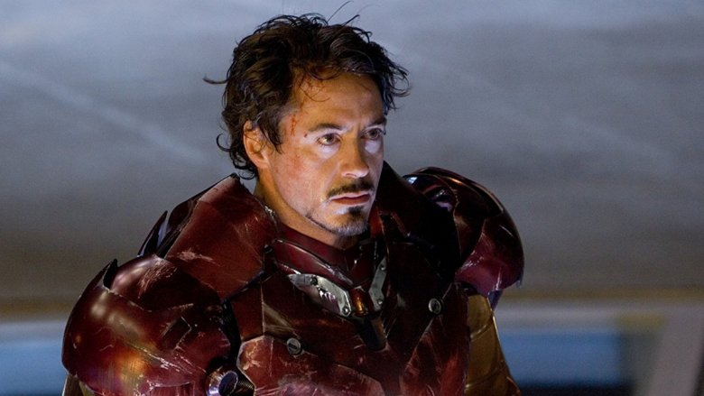
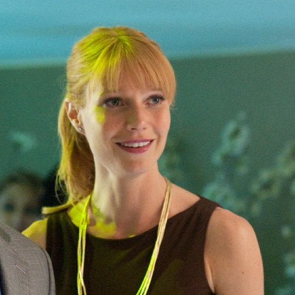
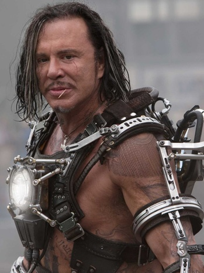

Iron Man 2
==========

.. warning::
    Movie spoilers

Iron Man 2 takes place several months after the ending of Iron Man. Many new
things are happening in Tony's life since he's announced to the world that he is
Iron Man. He realizes that his heart lifesource is slowly killing him. The
government is after the rights to all his technology. Lastly but most importantly,
someone is out to kill him. That man's name is Ivan Vanko, son of Anton Vanko
who worked with Tony's father. Full of hatred and jealousy, Ivan creates a suit
of his own and goes to America with the intention of killing Iron Man. He attacks
Tony in the middle of a Grand Prix race Tony was in. Tony barely gets out with his
life, but Vanko is arrested and claims his goal was just to show the world that
Iron man isn't invincible.

My Review
^^^^^^^^^
I liked this movie and thought it was a good continuation to the Iron Man series.
However I don't think it topped the original Iron Man. I think it was kind of
slow at times with less all around action, and more of one big scene at the end.
It was an interesting portray of an antagonist. Specifically there was a scene
in the middle of the movie where both Stark and Vanko were in the same room
together right after Vanko was arrested. It showed how calm Vanko is and how
visibly not worried he was. I believe he knew the prison couldn't contain him,
however Tony being Tony didn't seem to care and kept him there. That to me was
different from a "normal" villan who just wants to kill the hero. Because
everyone knows who Iron Man is behind the suit, I think the movie does a good
job at getting Tony's character in there as someone who loves the fame on the
outside. However behind the scenes he finds his love for his assistant Pepper.

Extra Information
-----------------

+--------------+----------------+---------+
| Soundtrack   | Link           | Artist  |
+==============+================+=========+
| Iron Man 2   | `Apple Music`_ | AC/DC   |
+--------------+----------------+---------+

A soundtrack was released for the movie by AC/DC. There are fifteen songs on
the album even though only two actually appeared in the movie. I'm not a huge
fan of AC/DC however I think it fit the movies' swagger and rock and roll. Scenes
of Iron Man flying in to save the day is better with some rock and roll behind it.

Important Characters
--------------------

* **Tony Stark**

    Played by: *Robert Downey Jr.* [#f1]_

* **Natalie Rushman**

.. figure:: scarlett.jpg
    :width: 300px

    Played by: *Scarlett Johansson* [#f2]_

* **Pepper Potts**

    Played by: *Gwyneth Paltrow* [#f3]_

* **Ivan Vanko**

    Played by: *Mickey Rourke* [#f4]_

* **Rhodey**

.. figure:: rhodey.jpg
    :width: 400px

    Played by: *Don Cheadle* [#f5]_

.. _Apple Music: https://music.apple.com/us/album/iron-man-2/575998519

.. [#f1] "`Played by: Robert Downey Jr. <https://www.looper.com/160363/the-entire-iron-man-mcu-timeline-finally-explained//>`_".
    Looper. 2019. Retrieved 2021-12-13.
.. [#f2] "`Played by: Scarlett Johansson <https://www.marvel.com/>`_".
    Marvel. 2017. Retrieved 2021-12-13.
.. [#f3] "`Played by: Gwyneth Paltrow <https://ficquotes.com/pepper-potts-im2-character-quotes/>`_".
    Ficquotes. Retrieved 2021-12-13.
.. [#f4] "`Played by: Mickey Rourke <https://www.looper.com/160363/the-entire-iron-man-mcu-timeline-finally-explained/>`_".
    Marvel Movies Wiki. 2011. Retrieved 2021-12-13.
.. [#f5] "`Played by: Don Cheadle <https://www.marvel.com/>`_".
    Marvel. 2020. Retrieved 2021-12-13.