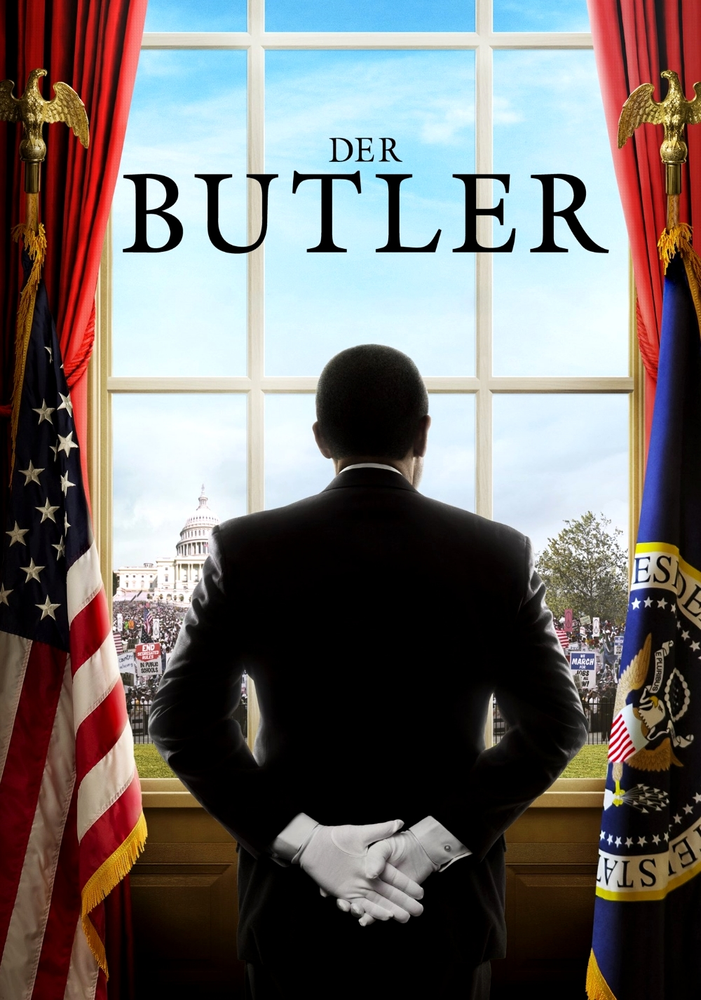

Lee Daniels' The Butler
=========================

Lee Daniel is a writer and director who showcases the culture and struggle of
the African American population in the States. The movie Lee Daniels' the Butler
follows a man who was born on a plantation. It is loosely based on the life of
Eugene Allen, who served through eight administrations.Cecil (the main character)
witnesses his father being shot in the and was made to be come a House Negro.He
spent years being a butler in hotels before eventually being hired as a butler
for the White House.

When his eldest son,Louis, went to college and started protesting segregation,
Cecil was not pleased. He felt like his son was throwing his life away and causing
trouble. Between his wife's alcohol problem, his youngest son dying in Vietnam,
and the resentment towards his eldest son he became stressed and unhappy. To him,
it seemed like they had come so far from when he was a child in the cotton fields
and a House Negro and he did not see why people could not see the progress. Even
though some progress was made, black Americans who worked at the White House were
working **60% less** than their white counterparts.

Towards the end, Cecil came to realize his son was not wrong for speaking up
against inequality. He was feeling a sense of worthlessness and felt like he spent
his life kissing up to people who were never going to see him as a human. The movie
perfectly highlights the changes in tactics for protesting over the Civil Rights
Movement. Including actual footage of the  Civil Rights Movement helped get the
point cross of the hardship black Americans went through. It was saddening to see
that back American born during slavery were still alive in 2008 to witness Barack
Obama. It is great that they were able to see that but it is crazy to think that
slavery was not that long ago. There are about only a generation and two away from
slavery. The acting and historical accuracy added to the effect it had on the audience.

Messages and Review:
----------------------
* Don't be afraid to fight for equality
* The younger generation's way of protesting is not ineffective
* New approaches to problems does not make them any less effective

The movie was perfectly written and showed the historical struggle of Black Americans.
The time laps between presidents towards the end of the movie highlighted the years
that Cecil "wasted."

=============     ================
Actors             played by
=============     ================
Cecil Gains        Forest Whitaker
Louis Gains        David Oyelowo
Gloria Gains       Oprah Winfrey
=============     ================

   The Weinstein Company [#f1]_

.. [#f1] "`The Weinstein Company <https://whysoblu.com/lee-daniels-the-butler-movie-review/>`_".
   The Weinstein Company. 2013. Retrieved 2021-12-09.