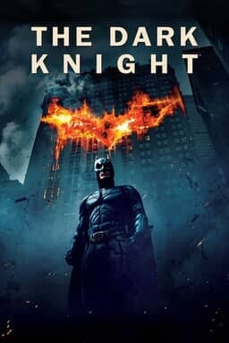

The Dark Knight
===============

   Warner Bros. Entertainment Inc. [#f1]_

Rating
------

10/10 Stars

Rating Process
^^^^^^^^^^^^^^
Bolded text is equal to rating given.

==========    =========     ======    =======
Category      2 Stars       1 Star    0 Stars
==========    =========     ======    =======
Actors        **Great**     Okay      Poor
Plot          **Great**     Okay      Poor
Directing     **Great**     Okay      Poor
Visual        **Great**     Okay      Poor
Music         **Great**     Okay      Poor
==========    =========     ======    =======

Review
------

*The Dark Knight* is the highest rated movie in my ratings. This movie grades
out so well in my ranking system because of how great the five aspects below
rank.

.. _my-reference-label:

Actors
^^^^^^

The acting in *The Dark Knight* is phenomenal, earning it a **Great** rating on
my scale, or 2 stars. Heath Ledger, Christian Bale, and Aaron Eckhart all
produce incredibly compelling performances. The late Heath Ledger, who passed
before the movie was released, won an Academy Award and Golden Globe for best
supporting actor for his role as the Joker. Additionally, his performance earned
him many other awards listed below. His portrayal of the Joker is
widely considered one of the greatest acting performances of all time.
Therefore, this movie scores two stars for the acting quality.

List of Major Awards for Heath Ledger's Joker Performance
~~~~~~~~~~~~~~~~~~~~~~~~~~~~~~~~~~~~~~~~~~~~~~~~~~~~~~~~~

* Oscar for Best Performance by an Actor in a Supporting Role
* BAFTA Film Award for Best Supporting Actor
* AFI International Award for Best Actor
* MTV Movie Award for Best Villain
* International Online Cinema Awards (INOCA) for Best Supporting Actor [#f2]_

Plot
^^^^
The plot continues the **Great** rating for *The Dark Knight*, once again
earning the movie 2 stars for this category. The story line is captivating and
interesting. Additionally, the story is easy to follow. The ending leaves
viewers in suspense and with a renewed sense of hope. Therefore, the film scores
two stars for the plot.

Directing
^^^^^^^^^
Director Christopher Nolan did an exceptional job directing *The Dark Knight*,
earning the movie another 2 stars for this category. Nolan successfully used
big name actors that fit their roles perfectly. Additionally, Nolan was able to
create a superhero movie that attracted more than just comic book fans. This
allowed *The Dark Knight* to be regarded as a cinematic masterpiece, and not
just another superhero movie. Therefore, under Christopher Nolan's direction,
this film earns two stars for the "Directing" category.

Visual
^^^^^^
Visually, this film earns the 2 stars and the **Great** rating for this
category. This rating is achieved because of the great one-shot photos that can
be taken from the film as well. In Addition, the film uses impressive CGI,
computer-generated imagery, as well as using real controlled events to impress
in the visual category. One example of this is when Heath Ledger's Joker blows
up Gotham General Hospital the film crew used an actual building that was set to
be destroyed and blew it up themselves. The movie scene can be viewed `here
<https://www.youtube.com/watch?v=pVz0k5AzM6A>`_. This commitment and the results
of it within the visuals of the film are why it earn two stars in the "Visual"
category.

.. warning::
    Loud noises and intense explosions are present in the linked movie scene.
    Viewers be advised.

Music
^^^^^
*The Dark Knight* finishes its 10/10 rating with 2 stars and the **Great**
rating in the "Music" category. The music throughout this film is the finishing
touch to the completeness of this film. It brings out the emotions of the movie
in such a prevalent way. James Newton Howard and Hans Zimmer made a score for
this film that evokes emotion and intrigues the audience. Therefore, this film
earns 2 stars for this category.

.. [#f1] "`Warner Bros. Entertainment Inc.
   <https://www.warnerbros.com/movies/dark-knight#about>`_".
   Warner Bros. Entertainment Inc. 2008. Retrieved 2021-12-4.

.. [#f2] "`IMDb
   <https://www.imdb.com/name/nm0005132/awards>`_".
   IMDb 2009. Retrieved 2021-12-8.
