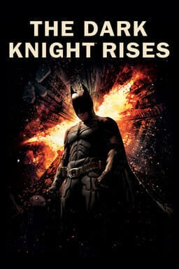

The Dark Knight Rises
=====================

   Warner Bros. Entertainment Inc. [#f1]_

Rating
------

8/10 Stars

Rating Process
^^^^^^^^^^^^^^
Bolded text is equal to rating given.

==========    =========     ========    =======
Category      2 Stars       1 Star      0 Stars
==========    =========     ========    =======
Actors        Great         **Okay**      Poor
Plot          Great         **Okay**      Poor
Directing     **Great**     Okay          Poor
Visual        **Great**     Okay          Poor
Music         **Great**     Okay          Poor
==========    =========     ========    =======

Review
------

*The Dark Knight Rises* is another high rated movie in my ratings. This movie
grades out well in my ranking system because of how great the five aspects below
rank.

Actors
^^^^^^

The acting in *The Dark Knight* is good, but not great earning it an **Okay**
rating on my scale, or 1 star. Christian Bale, Tom Hardy, and Anne Hathaway
all produce solid performances. The overall acting in the movie does not quite
live up to Heath Ledger's performance as the Joker in the prequel to this movie,
see :ref:`my-reference-label`. Even so, Bale Hardy , and Hathaway produce good
performances that lead to a successful and interesting movie. Therefore, this
movie scores one star for the acting quality.

Plot
^^^^
The plot continues the **Okay** rating for *The Dark Knight Rises*, once again
earning the movie 1 star for this category. The story line is interesting.
However, the plot seems to be guilty of overreaching at times. It focuses more
on action and fighting instead of the story. The ending counteracts this
problem by tying up loose ends and giving the audience a happy ending.
Therefore, the film scores one star for the plot.

Directing
^^^^^^^^^
Once again, director Christopher Nolan did an exceptional job directing
*The Dark Knight Rises*, earning the movie 2 stars for this category. Nolan
once again successfully used big name actors that fit their roles. Additionally,
Nolan intrigued fans with *The Dark Knight*, leading to lots of buzz around.
The *Dark Knight Rises*. Therefore, under Christopher Nolan's direction,
this film earns two stars for the "Directing" category.

Visual
^^^^^^
Visually, this film earns the 2 stars and the **Great** rating for this
category. The film uses impressive CGI as well as using real controlled events
to impress in the visual category. The fight scenes are well done and appear
very nicely on the screen. Also, the addition of winter weather also helps the
visuals in *The Dark Knight Rises* pop. These visual aspects of the film are
why it earn two stars in the "Visual" category.

Music
^^^^^
*The Dark Knight Rises* finishes its 8/10 rating with 2 stars and the **Great**
rating in the "Music" category. The music throughout this film is the finishing
touch to the quality of this film. It brings out the emotions of the movie
in such a prevalent way, especially as this trilogy comes to an end. Hans Zimmer
stayed for the completion of the trilogy and made a score for this film that
evokes emotion throughout. Therefore, this film earns 2 stars for this category.

.. [#f1] "`Warner Bros. Entertainment Inc.
   <https://www.warnerbros.com/movies/dark-knight-rises>`_".
   Warner Bros. Entertainment Inc. 2012. Retrieved 2021-12-5.