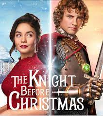

The Knight Before Christmas
===========================

.. warning::
    This movie review may be a spoiler

The Movie
----------
The Knight Before is a family-friendly movie on Netflix about finding love and
spreading Christmas spirit. This movie is about a medieval English knight
from the 14th century who gets transported to modern-day Ohio 2019, on a mission
to fulfill his destiny of becoming a true knight. The knight falls in
love with a science teacher in Bracebridge Ohio who no longer believes in true
love but found it days before christmas.

The Main Characters
--------------------
================ =====================================
Actor/Actress    Played as
================ =====================================
Josh Whitehouse  Sir Cole Christopher Frederick Lyons
Vanessa Hudgens  Brooke
================ =====================================

    * The ``director`` of this film is Monika Mitchell who’s known for writing
      other movies showcased on hallmark movies and Netflix category movies.

Genre of Movie:
^^^^^^^^^^^^^^^^
    | This is a **romantic Comedy** and a **holiday family friendly** film.

Movie Review
------------
Sir Cole:
^^^^^^^^^
The film starts off with Sir Cole Christopher Frederick Lyons (Cole) and other
knights going out hunting for a prize. Sir Cole departs on separate route from
his competitors and comes across an elderly woman in the woods who is freezing
cold and he offers to take her back to the castle on his horse. The elderly women
thanks him by granting him his wish of fulfilling his destiny in becoming a knight.
Sir knight is given an item that transports him to Bracebridge, Ohio at a
Christmas castle.

Brooke:
^^^^^^^
Brook meets Sir Cole at a Christmas castle when she accidentally runs into him
and spills her hot chocolate on his armor. The prince is seen in the film to be
amazed by the architecture and modern technology and wonders off in the in
Bracebridge, Ohio. Brooke accidentally hits him with her car while driving in a
blizzard. Those who meet Sir Cole assume that he might have amnesia because he
refers to himself as a 14th-century knight. Brooke invites the knight to stay at
her place since he seems to have lost his memory and does not have a place to
stay for the night.

    Netflix [#f1]_

Brooke and Sir Cole
^^^^^^^^^^^^^^^^^^^^
    * Sir Cole shares with Brooke that he once had someone he loved named Matilda
      and could not marry her because his duty as a knight is to first honor his
      quest and king.
    * Brooke shares with Sir Cole that her ex James cheated on her.
    * Sir Cole and Brooke share that they each have not seen their parents in
      forever.
    * Brooke’s parents died and Sir Cole has not seen his parents since he was
      sent away as a squire.

Brooke tries to help Sir Cole solve his quest: The knight saves two
little kids who were stranded on a frozen lake and he catches a pickpocket. At
this point in the film you start to wonder what the quest is that the knight is on.
The knight and Brooke continue to wonder what the quest might be. Its not until
December 24th during a Christmas eve feast, Brooke and her sister always host,
Sir Cole finds an opportunity to financially help a widower father of 4 little
kids with the contribution of the neighborhood. Sir Cole's quest is discovered
when he finds himself and Brooke standing under
mistletoe

Overall Thoughts:
^^^^^^^^^^^^^^^^^
The movie is good and can be watched with family and friends during the holiday
season. The story line is a bit cliche and some of the actors/actresses for me
were not as good for their role because of their acting and not not feeling like
I was drawn into the movie fully.

Footnotes:
^^^^^^^^^^
.. [#f1] "`Netflix <https://thecentraltrend.com/78177/opinion/the-knight-before-christmas-is-not-a-movie-i-would-watch-on-christmas-eve/>`_".
    The Central Trend. Retrieved 2021-12-14