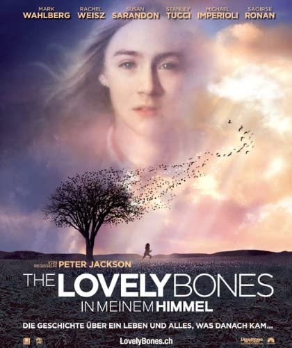

The Lovely Bones
==================

This was very emotional. It is about a young girl who is murdered by the next door
neighbor.The movie follows Susie (the main character) through her “heaven.”
Which is actually a place between Earth and the afterlife. She is able to see
people on Earth and some are  able to feel her presence.  The movie is based
off of a book who’s author was was kidnapped, rapped, and almost murdered.

Susie was a lover of photography and was just starting to experience life.
She had a crush, a new camera her parents gifted her for her birthday, and
clubs at school. All of this came to end when her older creepy neighbor,George,
saw her while he was talking to her parents.  George lures Susie to an
underground hangout place he claims he built for the kids in the neighborhood.
His sadistic nature takes control and he ends up killing Susie.She does not
realize that she is dead at first and she runs to get to safety. She feels like
she lost her voice and no matter how loud she screams, no one could hear or see
her. It is almost like he killed her twice.

In the midst of the chaos she is witnessing her family is going through, she
starts to accept the fact she will not be able to have her life back. Her family
starts to go their separate ways as they grieve. We see how the father and mother
start to drift apart because the father  was not satisfied  with the police’s
effort. The voice-over of Susie and the innocence in her voice adds to the tragedy
because she was so young and had so much to experience. It is a movie that
highlights the dangers of predators and the struggles families face.

`Movie Trailer <https://www.youtube.com/watch?v=s9PrQmcV81Y>`_.

Message and Review :
--------------------

* Not all neighbors are friendly
* Everyone grieves differently
* Moving on is necessary for the betterment of the family'

The music and upclose shots of Susie was  a great way of showing the years that was stolen from her and
invoked emotions on the audience.

   Paramount Pictures [#f1]_

.. [#f1] "`Paramount Pictures <http://vcencyclopedia.vassar.edu/alumni/inez-milholland.html>`_".
   Paramount Pictures. 2009. Retrieved 2021-12-09.